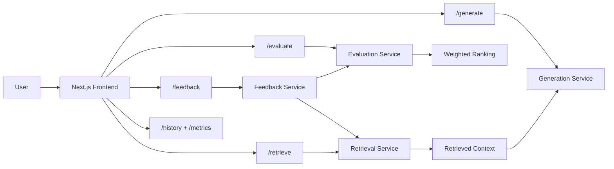

# EvalForge AI

EvalForge AI is a full-stack **LLM evaluation and feedback platform** for comparing multiple response strategies, scoring them with a structured evaluation pipeline, collecting user preference signals, and surfacing retrieval context for future generations.

It is built as a strong systems-style AI project: a React/Next.js dashboard on top of a FastAPI backend with modular evaluation, feedback, and retrieval services.

## Live Demo

- Frontend: [https://evalforge-ai-frontend.vercel.app](https://evalforge-ai-frontend.vercel.app)
- Backend API: [https://evalforge-ai-api.vercel.app](https://evalforge-ai-api.vercel.app)
- Backend docs: [https://evalforge-ai-api.vercel.app/docs](https://evalforge-ai-api.vercel.app/docs)
- Repository: [https://github.com/ArpanNarula/EvalForge-AI-](https://github.com/ArpanNarula/EvalForge-AI-)

## Why This Project Exists

Prompt iteration is usually messy, subjective, and hard to track. EvalForge AI turns that into a more structured workflow by giving you:

- multi-response generation for the same prompt
- side-by-side evaluation and ranking
- feedback collection to simulate RLHF-style improvement
- retrieval hooks for context-aware generation
- a dashboard view of history, ranking, and score behavior

## Key Features

- **Multi-response generation** for a single prompt using different response styles
- **Evaluation pipeline** combining rule-based scoring, similarity scoring, and judge-style scoring
- **Feedback loop** that adjusts scoring weights over time
- **Prompt history and metrics** for reviewing past runs
- **Retrieval endpoints** for context lookup and RAG-style extensions
- **Deployed full-stack architecture** with separate frontend and backend services on Vercel

## System Architecture



## Tech Stack

- **Frontend:** Next.js, React
- **Backend:** FastAPI, Python
- **Schemas:** Pydantic
- **Testing:** Pytest
- **Deployment:** Vercel
- **Current data layer:** lightweight in-memory stores for history, retrieval, and feedback

## How It Works

1. The user submits a prompt from the frontend.
2. The backend generates multiple candidate responses using different strategies.
3. The evaluation service scores each response across multiple dimensions.
4. The best response is ranked and displayed in the dashboard.
5. User feedback updates scoring weights to simulate RLHF-style refinement.
6. Positive sessions can be reused as retrieval context for future prompts.

## Current Implementation Notes

This project is intentionally built with **clean service boundaries**, but the current version is still a prototype-oriented implementation:

- generation is currently deterministic/template-driven rather than connected to a real LLM API
- evaluation uses lightweight local heuristics rather than external judge models
- retrieval is implemented as an in-memory service rather than a persistent vector database
- database initialization is currently a no-op placeholder

That means the architecture is real, the deployed system works, and the integration points are ready, but some “production” AI components are still roadmap items.

## What Makes It Strong For Recruiters

- it shows **full-stack ownership**
- it demonstrates **AI systems thinking**, not just prompt hacking
- it has a **modular backend architecture**
- it includes **evaluation, feedback, retrieval, analytics, and deployment**
- it is already **live on Vercel**

## Repository Structure

```text
frontend/
  pages/
  components/
  services/
  styles/

models/
services/
routes/
database/

backend_main.py
route_generate.py
route_evaluate.py
route_feedback.py
route_history.py
route_retrieve.py
```

## Local Development

### Backend

```bash
pip install -r requirements.txt
uvicorn backend_main:app --reload
```

### Frontend

```bash
cd frontend
npm install
npm run dev
```

### Frontend Environment Variable

For local development:

```bash
NEXT_PUBLIC_API_URL=http://localhost:8000
```

## Deployment Notes

This project is deployed as **two Vercel services**:

- `evalforge-ai-frontend.vercel.app` for the Next.js UI
- `evalforge-ai-api.vercel.app` for the FastAPI backend

This split is intentional because the frontend and backend use different runtimes and deployment models.

## Roadmap

- connect generation to a real LLM provider such as OpenAI or Claude
- replace heuristic judge logic with model-based evaluation
- plug retrieval into a persistent vector database such as ChromaDB
- add persistent database-backed session history
- support multi-model comparison
- add benchmark datasets and richer evaluation metrics
- upgrade frontend dependencies and harden production configuration

## Short Summary

EvalForge AI is a deployed full-stack project for **evaluating, ranking, and improving AI responses** through a modular feedback-driven workflow. It is designed to showcase practical AI product engineering: prompt workflows, evaluation systems, analytics, retrieval readiness, and production deployment.
